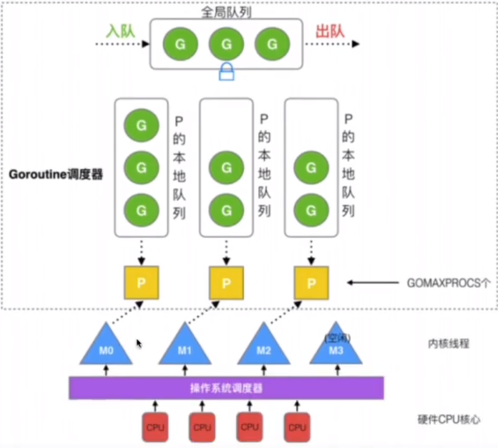

# 协程 Goroutine

=================

* [协程 Goroutine](#协程-goroutine)
    * [基础概念](#基础概念)
    * [协程与线程的区别](#协程与线程的区别)
    * [协程的调度](#协程的调度)
        * [GMP调度](#gmp调度)
        * [Goroutine的调度策略](#goroutine的调度策略)
        * [Goroutine的切换时机](#goroutine的切换时机)
* [返回](../README.md)

## 基础概念
协程：用户态的线程，可以通过用户程序创建，删除。协程切换时不需要切换内核态

## 协程与线程的区别
1. 线程是操作系统的概念，由操作系统调度执行；协程是程序级的概念，由程序自身控制
2. 线程切换时需要操作系统执行，消耗操作系统的资源；协程的切换依赖协程调度器，消耗用户态的资源，切换开销较小
3. 线程是抢占式并发，即操作系统可以随时剥夺一个线程的执行权；协程是合作式并发，协程的执行权由程序自身决定，只有当协程主动让出执行权时，其他协程才会得到机会

## 协程的调度
协程调度切换时，将寄存器的上下文和栈保存到其他地方，在切回来时，恢复先前保存的寄存器和栈。直接操作栈基本没有内核切换的开销，可以直接不加锁的访问全局变量，所以上下文切换非常快。

### GMP调度
**多个协程分配给多个逻辑处理器，调度到操作系统线程上，调度器在协程之间来回切换**
- G(Goroutine): Go协程，每一个go关键字都会创建一个协程
- M(Machine): 工作线程，数量对应真实的CPU数
- P(Processor): 处理器（Go中定义的一个概念，非CPU），包含运行Go代码的必要资源，用来调度G和M之间的关联关系，数量可通过GOMAXPROCS()来设置，默认为核心数。
  
线程想运行任务需要获取P，从P的本地队列获取G，当P的本地队列为空时，M会尝试从全局队列或其他P的本地队列中获取G，M运行G，G执行之后，会从P获取下一个G，不断重复下去。
### Goroutine的调度策略
1. 队列轮转：P会周期性的将G调度到M中执行，执行一段时间后，保存上下文，将G放入队列尾部，然后从队列中再取出一个G进行调度；P还会周期性的查看全局队列是否有G等待调度到M中执行。
2. 系统调用：当G0进入系统调用时，M0将释放P，进而某个空闲的M1获取P，继续执行P队列中的G。（M1可能来源与缓存池，或者新建的）
3. 当G0结束系统调用，如果有空闲的P，则获取一个P继续执行G0。如果没有，则将G0放入全局队列，等待被其他的P调度。然后M0将进入缓存池休眠。
### Goroutine的切换时机
- select操作阻塞时
- io阻塞
- channel阻塞
- 程序员显示编码操作
- 等待锁
- 程序调用

