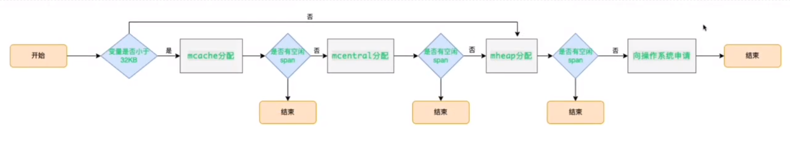

# 内存管理

=================

* [内存管理](#内存管理)
    * [内存分配机制](#内存分配机制)
        * [内存管理单元：mspan](#内存管理单元mspan)
        * [线程缓存：mcache](#线程缓存mcache)
        * [中心缓存：mcentral](#中心缓存mcentral)
        * [页堆：mheap](#页堆mheap)
        * [分配流程](#分配流程)
    * [内存逃逸](#内存逃逸)
        * [竞态](#竞态)
        * [逃逸分析](#逃逸分析)
        * [逃逸场景](#逃逸场景)
    * [内存对齐机制](#内存对齐机制)
    * [对象声明时的内存分配](#对象声明时的内存分配)
        * [make和new的区别](#make和new的区别)
* [返回](../README.md)


## 内存分配机制
- 采用Google的TCMalloc算法，每个线程会自行维护一个独立的内存池，进行内存分配时，会有先从内存池中分配。
- 当内存池不足时，会向加锁的全局内存池申请。
- 把内存切分的非常细，分为多级管理，降低锁的力度。
- 回收对象内存时，只是放回预先分配的大块内存中，方便复用。
- 当内存闲置过多时，会尝试归还部分内存给操作系统，降低整体开销

### 内存管理单元：mspan
- mspan是内存管理的基本单元，结构体中包含next和prev指向前一个和后一个mspan。
- 一个span由多个页（由结构体中的npages指定页数）组成，每个页面大小是8KB
### 线程缓存：mcache
- 缓存管理线程在本地缓存的mspan，每个goroutine绑定的处理器（P）都有一个mcache字段.
- mcache拥有一个allocCache字段，记录span中的元素是否被分配
- 当mcache中对应的span没有可使用的元素时，需要从mcentral中加锁查找
### 中心缓存：mcentral
- mcentral管理全局的mspan共所有线程使用，每个mcental结构都维护在mheap结构内
- 每个mcentral管理一种spanclass的mspan，并将有空闲空间(partial)和没有空闲空间(full)的mspan分开管理
- 访问mcentral需要加锁

**流程**  
- 获取：
  1. 加锁
  2. 从partial链表中找到一个可用的mspan，并将其从partial链表中删除
  3. 将取出的mspan加入full链表
  4. 将mspan返回给工作线程
  5. 解锁
- 归还：
  1. 加锁
  2. 将mspan从full链表中删除
  3. 将mspan加入到partial链表
  4. 解锁

### 页堆：mheap
mheap管理Go的所有动态分配内存，可以认为是Go程序持有的整个堆空间，全局唯一
### 分配流程
1. 计算规格
2. 使用mcache中对应大小的块分配
3. mcache中没有则向mcentral申请
4. mcentral也没有，则向mheap申请
5. mheap会找到最合适的mspan
6. 如果申请到的mspan超出申请大小，会根据需求进行切分，返回用户所需的页数，剩下的页数构成一个新的mspan，放回mheap的空闲列表
7. 如果mheap没有可用的span，则向操作系统申请一系列新的页（最小1MB）  

  

## 内存逃逸
### 竞态
在程序中，同一块内存同时被多个goroutine访问所产生的资源竞争
- 查看方式：-race
- 解决方式：加锁，让资源在同一时刻只能被一个协程操作
  - sync.Mutex
  - sync.RWMutex
### 逃逸分析
一般来说，局部变量在函数返回后会被销毁，因此被返回的引用就编程了“无所指”的引用。  
```Golang
func add(i, j int) *int {
	res := i+j
	return &res
}
```
函数add中的局部变量res发生了逃逸，此时，res指向的内存不能分配在栈上，随着函数的返回而收回，只能分配到堆上
- 查看方式：-gcflags=-m
### 逃逸场景
- 指针逃逸
- 栈空间不足逃逸
- 动态类型逃逸
  - 在编译期间不确定参数的类型和长度（比如函数的参数为interface）
- 闭包引用对象逃逸
## 内存对齐机制
- CPU以字长为单位访问。比如32位的CPU，字长为4字节，那么CPU访问内存的单位也是4字节.
- 为了能让CPU更快的存取到各个字段，Go编译器会把struct结构体做数据对齐，即内存地址是所存储数据大小的整数倍，以便CPU可以一次将数据从内存中读取出来。
- 合理的内存对齐可以提高内存的读写性能，并且便于实现变量操作的原子性

  
## 对象声明时的内存分配
- var 声明值类型的变量时，系统会默认给他分配内存空间，并附该类型的零值
- 如果是指针类型和引用类型的变量，系统不会为其分配内存，默认是nil

### make和new的区别
- make仅用来分配并初始化类型为slice, map, chan的变量
- new可以分配任意类型的数据，根据传入的类型申请一块内存，返回指向这块内存的指针，即*Type
- make返回引用，即Type